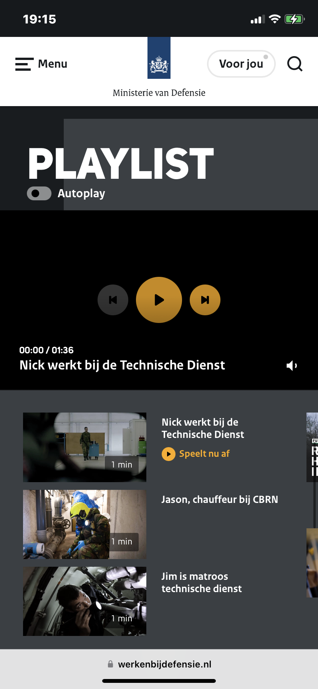
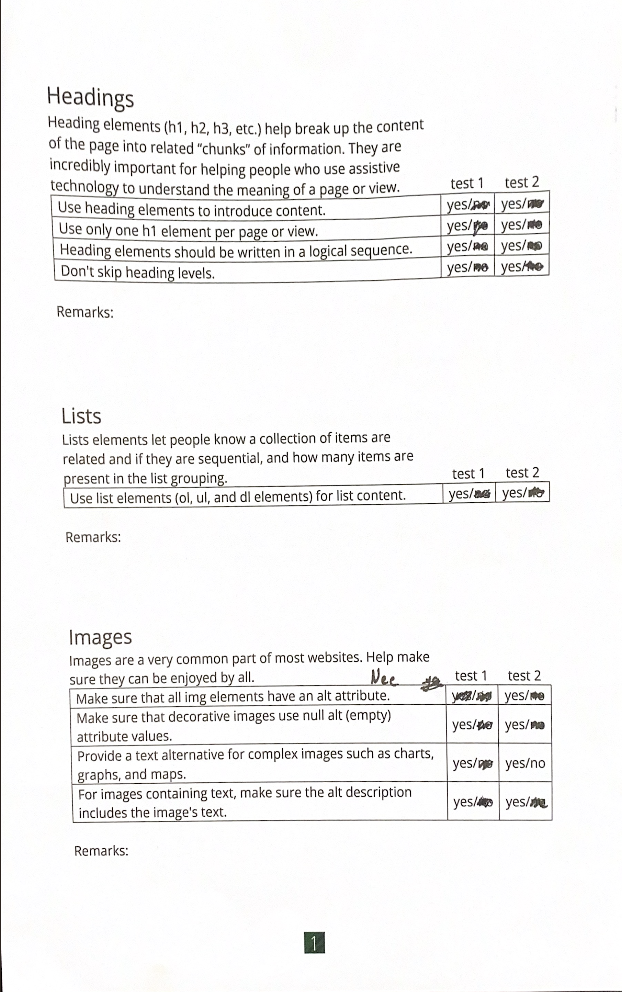

# Procesverslag
Markdown is een simpele manier om HTML te schrijven.  
Markdown cheat cheet: [Hulp bij het schrijven van Markdown](https://github.com/adam-p/markdown-here/wiki/Markdown-Cheatsheet).

Nb. De standaardstructuur en de spartaanse opmaak van de README.md zijn helemaal prima. Het gaat om de inhoud van je procesverslag. Besteedt de tijd voor pracht en praal aan je website.

Nb. Door *open* toe te voegen aan een *details* element kun je deze standaard open zetten. Fijn om dat steeds voor de relevante stuk(ken) te doen.

## Jij

  
uitwerken voor kick-off werkgroep

  ### Auteur:
 Mayra Veer

  #### Je startniveau:
 Mijn startniveau ligt op blauw

  #### Je focus:
 Ik wil mijn focus gaan leggen op de responsive plane. Ik wil ook een paar dingen toepassen van de surface plane.
 

## Je website

  
uitwerken voor kick-off werkgroep

  ### Je opdracht:
  https://werkenbijdefensie.nl 

  #### Screenshot(s) van de eerste pagina (small screen): 
  Ontdek defensie
  

  #### Screenshot(s) van de tweede pagina (small screen):
  Beheers de techniek 
  
  
  
  
  
  
 

## Toegankelijkheidstest 1/2 (week 1)

  
uitwerken na test in 2e werkgroep

  ### Bevindingen screenreader
  - De screenreader gaat erg snel
  - Hij spreekt slecht de Engelse woorden uit
  - Heel veel herhaling van woorden
  - Het is onduidelijk waar bepaalde linkjes staan op de pagina
  - Hij kan verschillende dingen door elkaar husselen en kan maar blijven doorgaan (geen carousel maken)
  - De stemmen zijn niet fijn om naar te luisteren (die kan je veranderen)
  - Bij een lees meer link is het fijner dat de screenreader erbij verteld wat je kan lezen

  ### Bevindingen screenreader website van Defensie:
  - Het is onduidelijk waar je precies op de pagina moet klikken
  - Er worden heel veel dingen herhaald met een link
  - Plaatjes worden niet uitgelegd
  - Video wordt wel uitgelegd, maar je weet niet wanneer de video voorbij is

  ### Bevindingen website van Defensie WCAG richtlijnen:
  
  ^ ik wil graag tijdens het voortgangsgesprek nog wat vragen hierover omdat ik over sommige dingen niet echt zeker was
  

## Breakdownschets (week 1)

  
uitwerken na afloop 3e werkgroep

  ### de hele pagina: 
  

  ### dynamisch deel (bijv menu): 
  

## Aantekeningen symposium (week 2)

Darice de Cuba:
- Laatdoof
- Chronisch ziek
- Gedeeltelijke hemianopsia

Het is belangrijk dat het lettertype die je in je website gebruikt goed te lezen is. Een contactformulier is niet echt toegankelijk,
want er kan staan dat je je telefoonnummer moet invoeren, maar als je doof bent kan je natuurlijk niet bellen, daarom is het handig
om een optie te hebben dat je niet gebeld kan worden. De beste contact optie: hoe wil je bellen: met gebaren taal of tekst. Het is
ook belangrijk om video's altijd te ondertitelen. Alles wat je kan zien hoeft niet ondertiteld te worden, maar praten en achtergrond
geluiden die je niet kan zien moeten wel ondertiteld worden. Alles moet in schone html staan. 
Geef opties aan dove of blinde mensen.

Bram:
- Volledig blind

Waarom nou toegankelijk maken? Beste toetsen om te gebruiken is shift en enter. Je kan het visueel kort houden met tekst, maar voor
iemand die blind is een soort verborgen tekst toevoegen zodat het duidelijk wordt wat bijvoorbeeld lees meer betekent. 
Zorg ervoor dat een video wordt uitgelegd wat je ziet. Kijk of je video te begrijpen is zonder geluid, maar wel met de screenreader.
Snap je alles wat er op de video gebeurt? Een video met alleen een muziekje valt niet te begrijpen. In cookiemeldingen zitten
veel toegankelijkheids fouten. Het is fijn als er een duidelijk structuur in de website zit.
Ga je niet alleen maar focussen op de richtlijnen maar denk ook na of dee gebruikerservaring wel fijn is. 
Het is irritant als er hele teksten staan in een plaatje.
Het is ook irritant als je een 'ben je een robot' formulier moet oplossen.

## Voortgang 1 (week 2)

  
uitwerken voor 1e voortgang

  ### Stand van zaken
  Tot nu toe gaat het redelijk goed met coderen, want ik ben eigenlijk alleen nog maar bezig geweest
  met de html en css. Ik vraag me natuurlijk af of ik misschien een paar dingen fout heb gedaan in mijn css of html.
  

  ### Agenda voor meeting
  samen met je groepje opstellen

  | student 1      | student 2          | student 3    | student 4        |
  | ---            | ---                | ---          | ---              |
  | dit bespreken  | en dit             | en ik dit    | en dan ik dat    |
  | en dat ook nog | dit als er tijd is | nog een punt | dit wil ik zeker |
  | ...            | ...                | ...          | ...              |

  Dit wil ik graag bespreken:
   - Een keer de WCAG richtlijnen doornemen of ik niet iets over het hoofd heb gezien
   - Gebruik ik mijn media query goed?
   - Staat mijn css en html goed en wat kan er anders?
   - Hoe zorg ik ervoor dat mijn video kan afspelen, want nu is het een soort foto
   - Hoe gebruik ik de sections goed?
   

  ### Verslag van meeting
  hier na afloop snel de uitkomsten van de meeting vastleggen

  - In mijn code had ik classes gebruikt, maar die mag ik niet gebruiken, dus hebben we dat aangepast
  - In css mag je niet een dubbele naam gebruiken bijvoorbeeld margin en margin top
  - De WCAG richtlijnen checklist heb ik nu volledig ingevuld
  - Om een video te laten afspelen voeg autoplay naast de src toe
  - Als je niet iets weet vooral het op google opzoeken
  

## Voortgang 2 (week 3)

  
uitwerken voor 2e voortgang

  ### Stand van zaken
  Ik heb nog steeds wel een beetje moeite met het positioneren van bepaalde elementen. 
  Ik vind het vooral lastig wanneer er iets niet werkt, wat ik er dan tegen kan doen. Ik heb nog best moeite om een oplossing te vinden.

  ### Agenda voor meeting
  samen met je groepje opstellen

  | student 1      | student 2          | student 3    | student 4        |
  | ---            | ---                | ---          | ---              |
  | dit bespreken  | en dit             | en ik dit    | en dan ik dat    |
  | en dat ook nog | dit als er tijd is | nog een punt | dit wil ik zeker |
  | ...            | ...                | ...          | ...              |

Dit wil ik bespreken: 
- Als ik in mijn menu ga kan ik niet op de middelste buttons klikken (precies op de plek van de video)

- Het lukt mij maar niet om 3 afbeeldingen te kunnen bewerken kwa grootte

- In de wat is jouw techniek container heb ik een tekst staan die center staat maar als ik hem groter maak
toch links center gaat staan

- Hoe krijg ik in de footer mijn buttons 2 om 2 naast elkaar (hoe kan ik grid hiervoor gebruiken)
- Hoe krijg ik de linkjes naast elkaar

  ### Verslag van meeting
  hier na afloop snel de uitkomsten van de meeting vastleggen

  - Bij media query elke screen and weghalen
  - Max width gebruiken op de fotos 
  - In het menu grid gebruiken van 2 kolommen
  - Oefenen met flexbox, grid en positioneren
  - Logo er nog in zetten
  - Ul li list maken met plaatjes, buttons etc, display grid gebruiken
  

## Toegankelijkheidstest 2/2 (week 4)

  
uitwerken na test in 9e werkgroep

  ### Bevindingen
  Tijdens het doornemen van mijn website om de toegankelijkheid te controleren, merkte ik dat ik wat dingen kon
  toevoegen om mijn website toegankelijk te maken, maar ook heel veel was al toegankelijk.
  - Ik had nog niet een functie dat de selectie een goed contrast had. Ik heb nu de background-color geel gemaakt en de color zwart
  zodat de slectie duidelijk te zien is en er genoeg contrast tussen de achtergrond en de tekst is.
  - Ik heb ook geleerd dat je een styling image een alt="" moet geven en niet de alt weglaten, want dan leest de screen reader
  de src voor.
  - Ik had al wel focus states een styling gegeven, maar werkte hij op de knoppen in de video niet. Ik ga dit nog proberen te fixen.
  - De focus state had op de defensie website een blauwe styling en die was best slecht te zien op de achtergrond, dus
  ik heb hem op mijn website geel gemaakt voor een beter contrast. 
  
  
  - Ik dacht aan hoe blinde mensen mijn video kunnen begrijpen zonder dat de video geluid heeft. Je zou dan een soort
  ondertiteling alt tekst voor videos kunnen toepassen (vtt). Zo kunnen blinde mensen de video toch begrijpen.
  - Ik ben alle contrasten gaan checken in mijn website en alles was goed 
  
  
  
  
  -Alleen bij de hover knop in de nav die op het plaatje staat was de contrast niet goed. Ik had de kleuren
  van de officiele website in de contrast checker gedaan en het contrast bleek niet goed te zijn.
  
  
  - Ik heb er nu een beter constrast van gemaakt als je over de button hovert
  
  - De officiele website van defensie heeft geen light mode, misschien
  leuk om dat te proberen toe te passen.

## Voortgang 3 (week 4)

  
uitwerken voor 3e voortgang

  ### Stand van zaken
  hier dit ging goed & dit was lastig (neem ook screenshots op van delen van je website en code)

  ### Agenda voor meeting
  samen met je groepje opstellen

  | student 1      | student 2          | student 3    | student 4        |
  | ---            | ---                | ---          | ---              |
  | dit bespreken  | en dit             | en ik dit    | en dan ik dat    |
  | en dat ook nog | dit als er tijd is | nog een punt | dit wil ik zeker |
  | ...            | ...                | ...          | ...              |

 ## Mijn vragen
 - Mijn afbeelding container in mijn menu doet het nog steeds niet goed als hij op telefoon
 grootte staat, hoe kan ik dit fixen?
 - Mijn github werkt niet
 - Hoe ga ik mijn classes in de header weghalen, hoe ga ik dee div in een div met nth-of-type selecteren
 - Hoe lijn ik de stel je vraag hier tekst in de footer links uit?
 - Is al mijn code goed ingesprongen?
 - Buttons in linkjes veranderen footer

  ### Verslag van meeting
  hier na afloop snel de uitkomsten van de meeting vastleggen

  - Linkjes horen je te brengen naar een andere pagina en butttons zorgen ervoor dat er in dezelfde pagina waar je
  in zit iets gebeurd.
  - Zorg ervoor dat je github desktop gebruikt, want dat werkt beter
  - Met de + kan je het eerste element dat na een bepaald element komt selecteren
  - Alle code leek goed ingesprongen te zijn

## Aanbevelingen 

- Voor de video die geen geluid bevat zou ik een vtt functie kunnen toevoegen die een soort ondertiteling
biedt voor mensen die slechtziend/ blind zijn, zodat ze als nog kunnen weten wat er in de video gebeurd.
- Om een fijne ervaring te bieden aan een gebruiker die in het licht of donker naar de website kijkt,
is het ideaal als de website een licht en donker modus heeft.
- Voor de mensen die een screenreader gebruiken en gelijk naar de belangrijkste informatie willen gaan, zou ik ene skip link kunnen toevoegen. 
- Om altijd bij het menu te kunnen tijdens het scrollen zou ik de header fixed kunnen maken en 
dan wanneer er gescrollt wordt, er een witte achtergrond aan toevoegen en het menu icoon zwart maken. 
- Om de linkjes in de footer er mooier uit te laten zien kan bij bij een min breedte van 30em de border breedte van de linkjes
niet zo breed laten lijken. 

## Eindgesprek (week 5)

  
uitwerken voor eindgesprek

  ### Je uitkomst - karakteristiek screenshots:
  
  - Het menu vind ik goed gelukt. Met hulp van de oefenining op code pen
  heb ik voor het eerst een menu kunnen maken die in de pagina slide.
  - Het maken van de binnenkant van het menu ging wel wat lastiger, omdat ik heel vaak vast liep. Ik kreeg hier gelukkig veel hulp bij bij de voortgangsgesprekken.
  - Achteraf vond ik het best leuk om een website na te maken, want dit geeft mij een goed gevoel dat coderen niet super moeilijk hoeft te zijn om een goede website te maken.
  - Ik had wel best vaak moeite om de juiste elementen te selecteren met nth of type, want soms was het lastig om te weten in welke volgorde je de elementen moest zetten om het juiste te selecteren.
  

  ### Dit ging goed/Heb ik geleerd: 
  Korte omschrijving met plaatjes

  
  - Ik heb geleerd hoe je met media querys moet werken en ik ben blij dat het is gelukt bij mijn plaatjes, want als het scherm groot is lijnen de plaatjes onder elkaar rechts uit en wanneer het scherm klein is lijnen ze onder de tekst uit.

   
  - Ik dacht eerst dat de grid pagina lastig was om te maken, maar ik snapte al snel hoe ik de plaatjes op deze manier kon weergeven.

  
  - Het verdelen van de informatie op de pagina ging ook goed.

  
  - Ik heb bijna alle linkjes en buttons met een hover effect voorzien.

   
   - Het toevoegen van een light mode was makkelijker dan verwacht.

   
   - Dit stukje code heeft ervoor gezorgd dat ik niet kon scrollen in mijn nav
   ik ben blij dat ik hierachter ben gekomen, want niemand wist waaraan het lag.

  ### Dit was lastig/Is niet gelukt:
  Korte omschrijving met plaatjes

  
  - het positioneren van de tekst en de button ging niet zo goed en is ook niet mooi gelukt. 
  Het is niet echt mooi responsive.
  
  
  - De linkjes nemen de hele pagina in (bij een groot scherm) terwijl dat eigenlijk niet moet. Het is me niet gelukt om dit mooi te kunnen stylen.

  
  - Ik had best veel moeite met het maken van de navigatie en daarin weer de content op de juiste plek te zetten. Het zou ook beter zijn dat je de tekst ziet in het plaatje wanneer het klein scherm is zodatje weet dat je moet scrollen.

## Bronnenlijst

  
continu bijhouden terwijl je werkt

  Nb. Wees specifiek ('css-tricks' als bron is bijv. niet specifiek genoeg). 
  Nb. ChatGpT en andere AI horen er ook bij.
  Nb. Vermeld de bronnen ook in je code.

  1. hamburger menu - https://codepen.io/shooft/pen/VwJXNEg 
  2. media-query uitleg - https://www.strato.nl/hosting/typografie-in-responsive-webdesign/#:~:text=Als%20je%20%40media%20combineert%20met,het%20lettertype%20van%20grootte%20verandert
  3. grid - https://codepen.io/mayr4/pen/OJeqRXK 
  4. tekst over afbeelding positioneren - https://kinsta.com/nl/blog/css-styling-afbeeldingen/#:~:text=Om%20tekst%20bovenop%20een%20afbeelding,positionering%20en%20z%2Dindex%20gebruiken.&text=In%20de%20bovenstaande%20code%20dient,de%20afbeelding%20als%20de%20tekstoverlay
  5. animation schud effect - https://blog.hubspot.com/website/css-animation-examples
  6. video werkend maken -  https://krasenslavov.com/video-player-with-custom-controls-adding-a-play-button-overlay/
  7. border box - https://www.freecodecamp.org/news/what-is-box-sizing-border-box-css/
  8. position absolute - https://www.handleidinghtml.nl/css/css-elementen/css-elementen09.html#:~:text=Met%20de%20eigenschap%20position%3A%20absolute,(bijvoorbeeld%20absolute%20of%20relative).
  9. inline elementen - https://www.w3schools.com/html/html_blocks.asp

